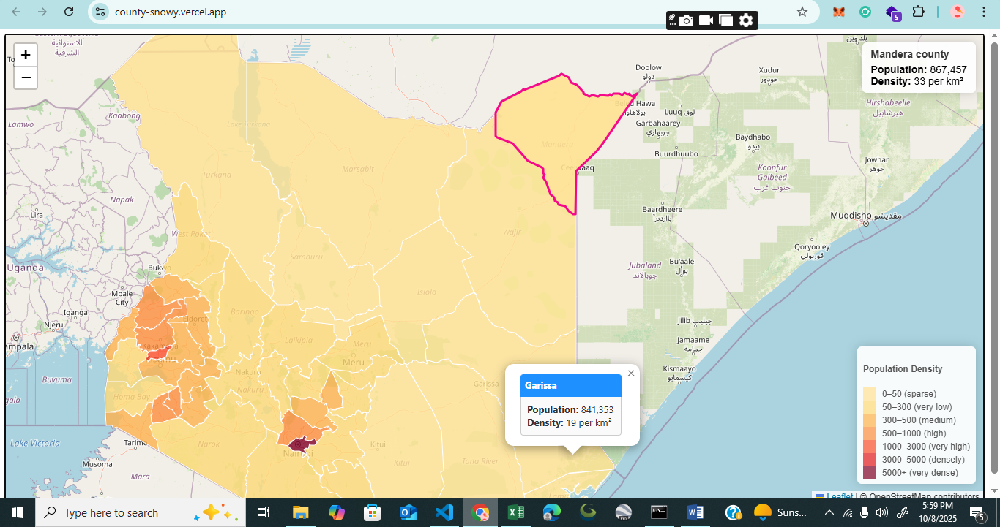

# Kenyan Counties Population Density Web Map



[🔗 **View Live Demo**](https://enock-ui.github.io/County/)

---

## Overview
This project is an interactive web map that visualizes the population density across Kenyan counties using **Leaflet.js** and **GeoJSON** data. Each county polygon is styled according to its population density, creating a choropleth map that highlights spatial variations in population distribution.

---

## Key Features
- **Dynamic Choropleth:** Counties are shaded by population density, with color intensity increasing with density values.  
- **Interactive Information Panel:** Hover over any county to view its name, total population, and density (people per km²).  
- **Popups on Click:** Click a county to zoom in and display more detailed information.  
- **Custom Legend:** Explains population density ranges and corresponding color codes.  
- **Smooth Hover and Zoom Effects:** Enhances user experience through visual feedback.  
- **Base Map Tiles:** Uses OpenStreetMap as the background layer for reliable, open geospatial coverage.

---

## Population Density Classification

| Range (People per km²) | Category   | Color Code |
|-------------------------|------------|-------------|
| 0–50                    | Sparse     | `#FED976` |
| 50–300                  | Very Low   | `#FEB24C` |
| 300–500                 | Medium     | `#FD8D3C` |
| 500–1000                | High       | `#FC4E2A` |
| 1000–3000               | Very High  | `#E31A1C` |
| 3000–5000               | Densely    | `#BD0026` |
| >5000                   | Very Dense | `#800026` |

---

## Technology Stack
- **Leaflet.js** – Interactive web mapping and GeoJSON rendering  
- **HTML5 / CSS3 / JavaScript (ES6)** – Front-end structure, styling, and interactivity  
- **OpenStreetMap Tiles** – Base map layer  
- **GeoJSON Dataset** – Contains Kenyan county boundaries and population data  

---

## Spatial Analysis Insights
The analysis highlights significant regional variations in population density across Kenya:
- Higher densities in urban and economically vibrant counties such as **Nairobi, Kiambu, Nakuru, and Mombasa**.  
- Lower densities in **northern and arid regions**, including **Turkana** and **Marsabit**.  

The spatial pattern reveals how population concentration correlates with economic activity, infrastructure, and climate suitability.

---

## How to Run Locally

```bash
# Clone the repository
git clone https://github.com/enock-ui/County.git

# Navigate into the project folder
cd County

# Open the main HTML file in your browser
start index.html   # Windows
open index.html    # macOS
